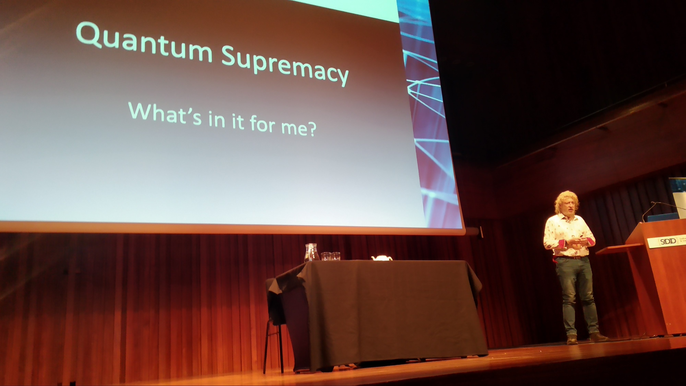

# SDD 2022 Conference Day 0

## What is it?

The [Software Design & Development - SDD](https://sddconf.com) conference is an anual conference with more than 10 editions and a lot of known [speakers from the industry](https://sddconf.com/speakers/)

I will be attending sessions ranging from Quantum Computing, to Micro Services Orchestras, CQRS, Event Driven Architectures and Data Versioning. Pretty awesome.

Porting these concepts to Outsystems is not as weird as it sounds, and its actually natural - Outsystems is a subset of software engineering and these concepts are bound to it.

----

## Getting here

The trip to London was lots of waiting, late flights, short connections, a lady had an heart attack at one of the flights, a dog kept barking the entire flight next to me... my usual luck.  
Also, it looks like Covid is nowhere around here, we're back to coughing on each others necks at packed buses, no masks at the event, looks like 2019!
I also forgot (1) to bring pounds, (2) that the brits drive on the other side of the road, which led to some funny shenanigans.

On to the first session. Hint - We're doomed.

God save the queen.

----
