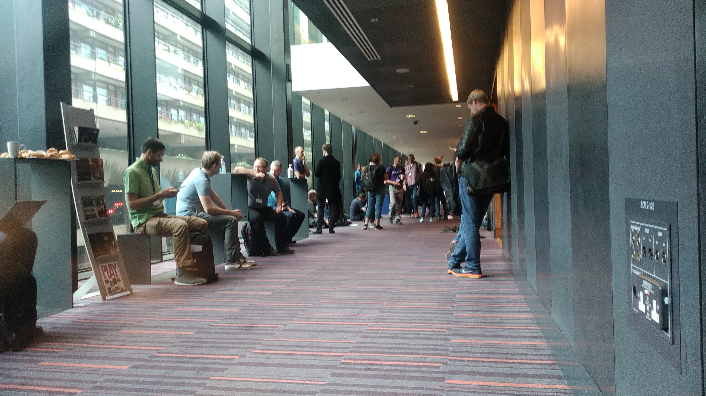
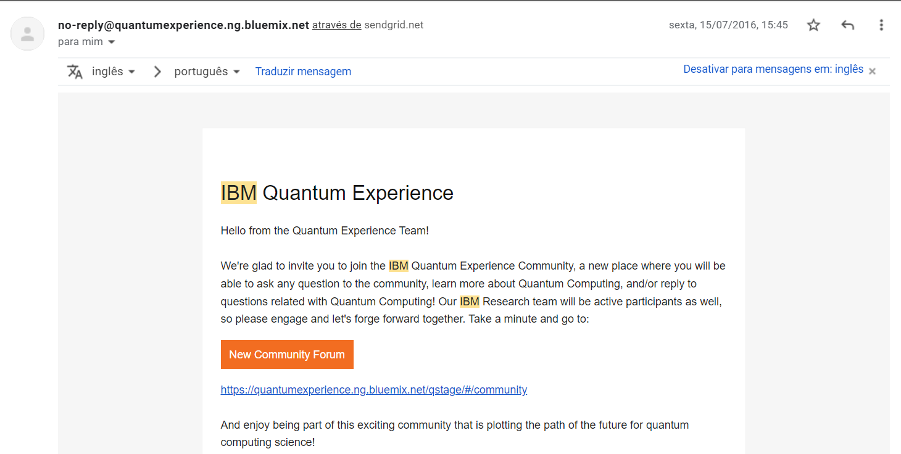
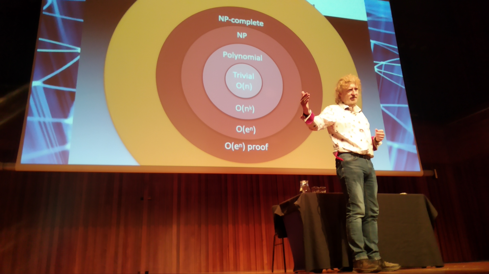
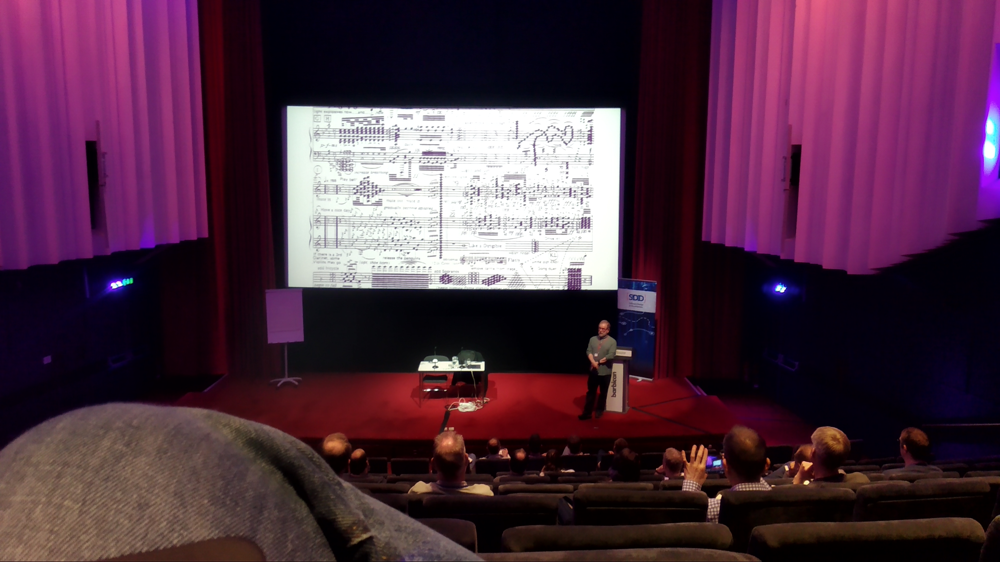
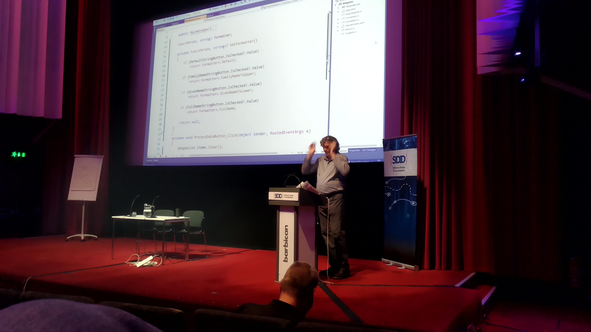

# SDD 2022 Conference Tuesday

----

## Quantum supremacy: what's in it for me? - [Jules May](https://sddconf.com/speakers/#sp5033)

Maaaaaannn, this got me kind of scared.
I actually got one of the "early access" of the IBM quantum sandbox back in 2016:  

  

I couldn't understand anything back then, and it's still a bit of a mystery now. We have 1's, 0's and now 50% 1's, 70% 0's, spins, entangled bits and what looks like a music sheet as the programming IDE.  
China already uses entangled bits to Morse code their ultra secret stuff (we were told). Granted, it's still kind of iffy to transport a huge cylinder of nitrogen around to your destination (I’m not really sure how it's done, but it's something like that), but still - it's instant communication. Not speed of light comms, instant, like, instant. The kind that makes Earth - Mars comms trivial.  

Anyway, the scary thing is breaking crypto. It will happen sooner than later and although there's a lot of smart people working on new ways to encrypt that are quantum proof, its still a road to walk.

  

----

## Do or don’t. There’s no try. Or is there? The power of monads explained. Sort of - [Sander Hoogendoorn](https://twitter.com/aahoogendoorn)

This session was probably one of the most dense and advanced at this conference. Although monads and algebraic expressions are associated with functional programming (which is kind of my happy place), there's a lot to extract from this.  
It is said (at least in that movie, arrival..) that the way you think can be reprogrammed by learning a new language and I believe the same thing holds true to programming paradigms.  
Thinking about everything you do as chainable inputs and outputs, making bullet proof simple functions with single responsibility patterns are great concepts but the one I found most valuable is that less code means less errors, and this holds true at any paradigm, even low code - why not even less code?

----

## Choreographing Microservices - [Allen Holub](https://twitter.com/allenholub)

Great session.  
Outsystems seems to be embracing microservices architectures with project NEO, and there is a lot to learn regarding this mind-set.  
[Allen Holub](https://twitter.com/allenholub) did a great, great job on this session, by simplifying a lot of what can get messy real fast real quick. Here are some of the nice patterns to retain:

- The vegas principle - What happens in a microService stays at a microService
- Always have Idempotent services
- REST is bad for microServices (and so is almost everything else)
- Fail fast
- Recovering from points of failure is hard
- Use event driven and reactive patterns for microservices orchestrations
- MVC is a lie (I always hated it anyway, I mean, where is the decoupling when you change the model??)  

### All in all, **Architecture is about trade-offs.**

  

----

## Getting Func-y: understanding delegates in C# - [Jeremy Clark](https://twitter.com/jeremybytes)

This was a really fun session. It's incredible how C# is approaching functional patterns that at the end of the day, make your code more robust and error free.  
ASP.NET Core's new lambdas API styles were also covered which might be mirrored on new Outsystems extension models, but all of the above can already be used generically on any extension.

  

----  
