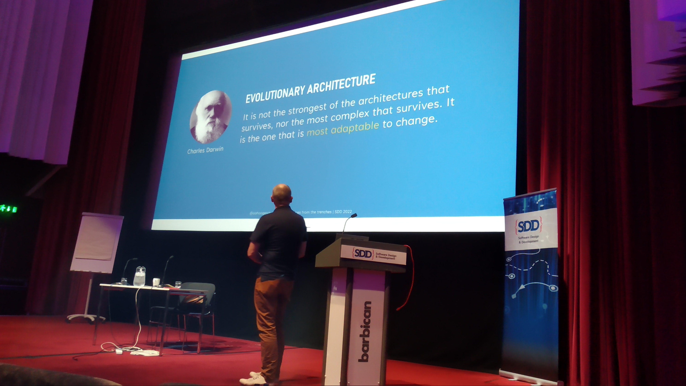
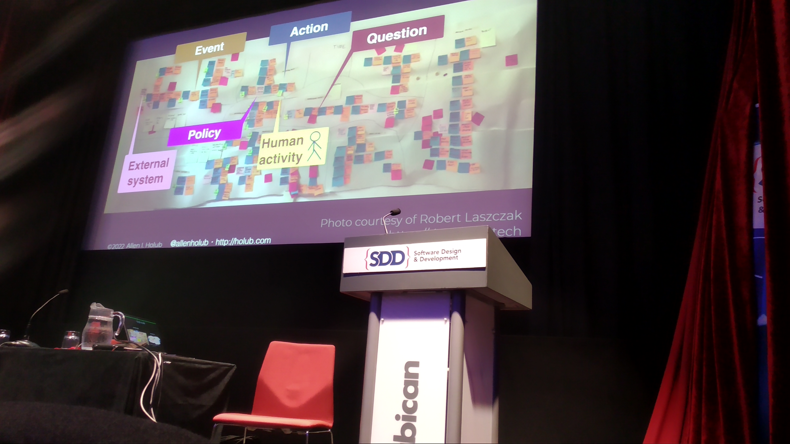
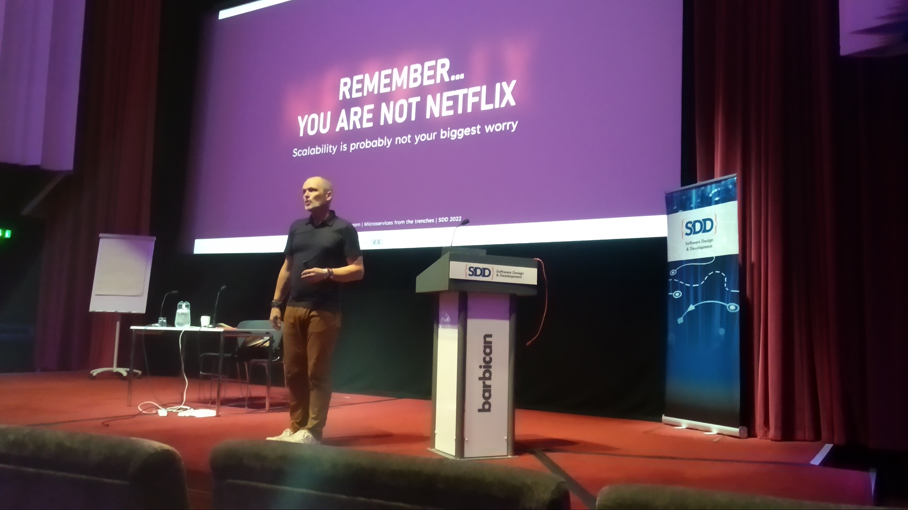
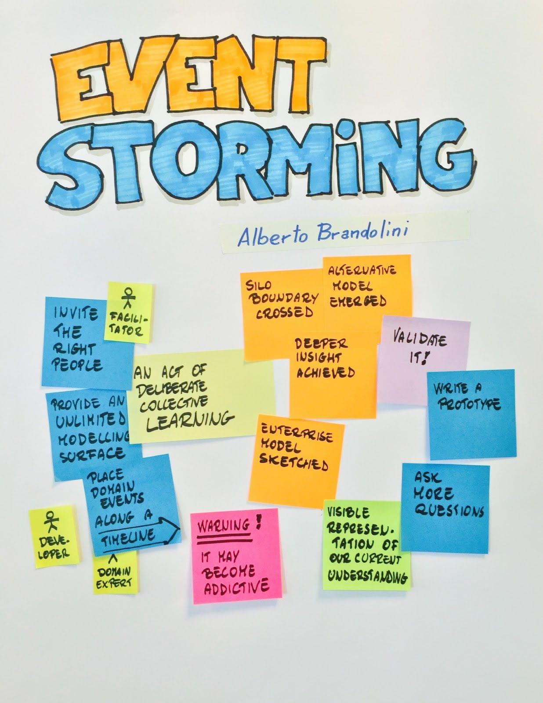
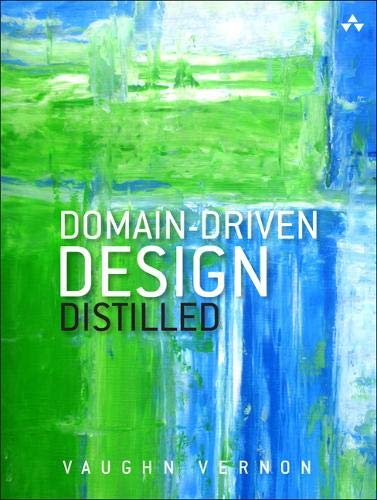

# SDD 2022 Conference Wednesday

----

## Practical event storming - [Allen Holub](https://twitter.com/allenholub)

Event Storming was invented by Alberto Brandolini and it is essentially a business process modeling technique. Agile of course.  
There are a lot of sticky notes involved. When I say a lot I mean A LOT. I even learned how to properly apply a sticky note to different surfaces like glass or paint, and that there are different levels of sticky notes and a whole new world of.. Sticky.. Notes.  

  

The process is very intuitive and clean and it effectively bridges technical teams and domain experts (Users) when architecting event based systems.

Besides the practical aspect of this talk, there were a lot of interesting discussions around Microservices, Agile, and specifically how event based architectures are agile in nature vs. say, N Tier architectures, where it's just hard to be Agile if you have specialized teams across the N boxes. Nonetheless there are trade-offs:  

- Testing will be hard(er). Probably will have to be done in live environments.
- Unpredictability
- More complexity in order to reduce coupling

Check out this Sticky Notes thingy: [miro.com](https://miro.com)

----

## Building a Microservices architecture in small steps - [Sander Hoogendoorn](https://twitter.com/aahoogendoorn)

There was so much to digest here. Why would you go with a MicroServices architecture anyway? What is it solving? Why does it matter?

Take for instance a very very simple model of a Product and Orders. Would it make sense to have a dedicated Product service with its dedicated Product Database and another with its Order Service and Order Database? Maybe. But we can easily see how complexity will quickly escalate when simply trying to get all Products for a specific Order.  
There are many ways to tackle the above which I won't go in depth, but **services own their data**.  

MicroServices **solve scalability problems**, and have very Low Coupling with High Cohesion which is great for robust, scalable and independent systems. That's a given. But the monolith project is not wrong if it's fulfilling our needs.  
It might be that we fear to be outplayed - that a smarter, faster product will turn ours obsolete. Or that our Legacy project is just not maintainable anymore and we need to decouple it, or that we simply need to scale certain aspects of our app.  

Its also worth noting that CI/CD pipelines become an absolutely essential piece of the entire process, not only for automating functional tests, but also load tests, security tests, performance, availability and of course feedback on the service availability itself.

  

----

## Lunch

----

## Hidden treasures: browser APIs - [Christian Wenz](https://twitter.com/chwenz)  

There were some changes in the deck line up, and I found myself having to decide on the spot which session to attend. I decided to humble myself down and try to be surprised by the tool we use every single day. And there was just some great stuff there! Here are some of the "hidden" treasures:  

- requestFullScreen
- execCommand (copy/cut)
- clipBoard
- batteryStatus
- connectionApi (network)
- notificationApi
- PWA Service Workers
- paymentRequest
- Bluetooth Api
- Speech Api
- WebShare
- WebAuthN

Not only are these a great refreshment of the browser's capabilities but every single API above is a **potential useful Reactive Component in Outsystems**.

Here are some useful Browser API resources:  
[web-api-examples.github.io](https://github.com/web-api-examples/web-api-examples.github.io)  
[browserapis.wtf](https://github.com/Rumyra/browserapis.wtf/tree/master/source/browserapis)  
[w3c](https://github.com/w3c)  

----

## The effective developer – work smarter, not harder - [Sven Peters](https://twitter.com/svenpet)

This was a very insightful session to end the day with a deep dive on "work smarter not harder".  
There were 5 distinct subjects composing the effective developer:  

- Team Code
- Learning
- Experiment
- Reducing overhead
- Work on what matters

Now, I do believe that this shift comes with experience. It's just natural to try to be *Efficient* earlier on on any career path, focusing on outputs, measurements, automations, getting stuff done, processes, and so on. It's clear.  
But to be *Effective* the thought must be shifted into **simplicity over cleverness**, into getting the **right stuff done** over just stuff done and above all, into **outcomes** over outputs. I'm hoping to expand on the 5 subjects above in the near future.  

----

## Books

Couple of books recommended from today's sessions:

