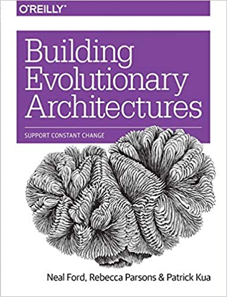

# SDD 2022 Conference Thursday

----

## Communication styles for Distributed Architectures and Microservices - [Neal Ford](https://twitter.com/neal4d)

I don't want to "fanboy" over the next sessions but come on... it's Neal Ford for the rest of the day. At some point I asked something about eventual consistency and compensation errors and he was like "Yeah, you can check my friend's blog, Martin Fowler".  

What a talk, this is the good stuff. Regarding communication styles, we deep dived into the 3 dimensional space of communications across distributed systems. The 3 axis are:  

- Sync vs Async
- Atomic vs Eventual (transaction consistency)
- Orchestra vs Choreography

It looks like this:  

       |(Sync vs Async Axis)
       |
       |
       |
       |
       |_ _ _ _ _ _ _ _ _ (Atomic vs Eventual Axis)
      /
     /
    /(Orchestra vs Choreography Axis)

Every system falls into one of the patterns above (or a hybrid), called "Transactional Sagas". The Monolith one is called the Epic Saga, and is of course Synchronous, Atomic and Orchestrated. At the other end of the spectrum we have the Anthology Saga which is Async, Eventual and Choreographed.

There are Pros and Cons for each possible saga. Some are Anti-Patterns(the Horror Saga, Async, Choreographed, Atomic), some tend to be used more often (The Fairy Tail Saga, Sync, Orch, Eventual), but there's isn't really a "correct" pattern here, **its all about trade-offs**.  

Regarding the communication protocols, loosely coupled contracts (like just json) are obvious winners when scaling things up to thousands of bandwidth requests/s.  

----

## Restructuring & migrating architectures - [Neal Ford](https://twitter.com/neal4d)

What are the drivers for thinking about restructuring a current architecture?  

- Service Granularity - Break apart, put together, functionality, volatility (of code), scalability, fault tolerance, security  

- Database Granularity - Connectivity issues, bottle necks, fault tolerance  

This was an interesting talk for several reasons. For one, the working example was this *Electronic Recycling App* that started small, as a monolith, and things went really really well for them and they needed to scale the entire thing. Do iT Lean has guided several academic projects on this topic, so it was familiar territory. On the other hand, the techniques applied had a natural direct hit on Outsystems best practices and techniques for refactoring.  

Take the "Shared Techniques". We check for horizontal overloaded references between core modules, cyclic perhaps, and a) on MicroServices architectures we might duplicate the concepts or b) on Service Based Architectures we might want to "lift" a new module, like a BL module.  
Or "Modularity Techniques". We take a tool to analyse the module dependencies - lets say.. Discovery! Then we can have a manual decomposition of the modules, or, a tactical forking - which is to duplicate and delete what no longer will be a part of the new module.
Another technique was to "Branch by Abstraction" with toggle features as an anti corruption layer - also discussed within Outsystems.

----

## Domain to Architecture Isomorphism - [Neal Ford](https://twitter.com/neal4d)

Essentially we are addressing how to map problem domains into architecture patterns, hence the iso(equal) morph(shape).

On the Monolith corner:  

- Layered Architecture
- Modular Monolith (OS)
- Micro Kernels (OS)

On the Services corner:  

- MicroServices (OS)  
- Service Based (OS)  
- SOA  
- Event-Driven(not as a communication pattern, as an architecture style)  
- Space Based  

All of them have their strengths and weaknesses on several characteristics: Deployability, Elasticity, Evolutionary, Fault Tolerance, Modularity, Cost, Performance, Reliability, Scalability and Testability.

You've noticed I've put an (OS) mark in front of some of the patterns. This is because I believe that these patterns are already in place or can be applied to the current Outsystems platform.  

The Modular Monolith makes direct sense. What about Micro Kernels? These are "nothing" apps that only have functionality through different integrations, or plugins! If our app is nothing but integrations with functionality providers, like a map provider, a payment provider, a file provider, a big data, ocr, etc. then it is basically it.  
The Service Based pattern is essentially to just follow Outsystems(11) best practices on decoupling, weak references and separation of concerns. I could argue that this is the current default Outsystems App.  
But MicroServices?? So, forget about the metal for a second (databases, iis, etc). If we have completely loose Applications with **well defined bounded contexts** and **no side effects** or dependencies between these "micro applications", then this is the logic definition for it! We kind of already do that with proper App composition. Sure, we won't extract the benefits of total isolation and scalability as we would on proper dedicated microservices infras like k8s, but the concept is in place.  

Just great exploratory stuff and food for thought.

----  

## Books

There were several book recommendations today, here's my top 3:

----

## That's a wrap

An overall great conference. The speaker's quality was great, the content was focused on modern patterns, and it was very well organized.  
I decided to check the surroundings after the conference. Here's some findings.

### Here's Brit's big hours device  

### Here's Brit's big circle device  

  
----
