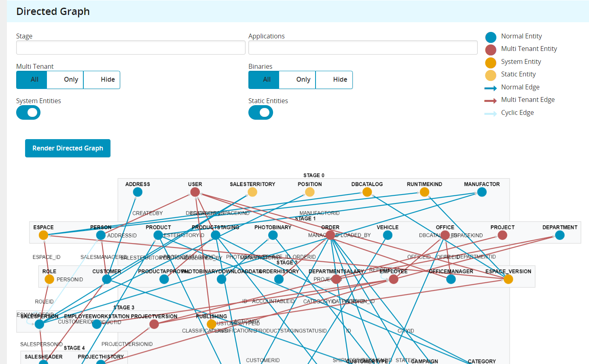
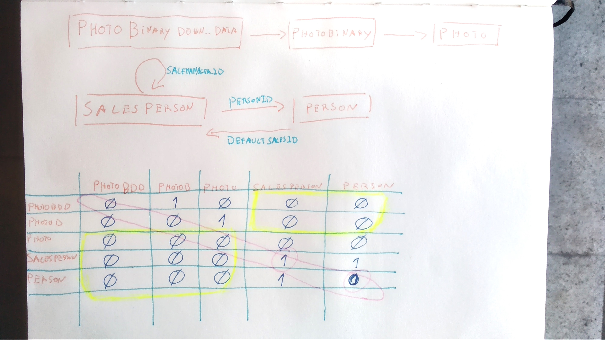
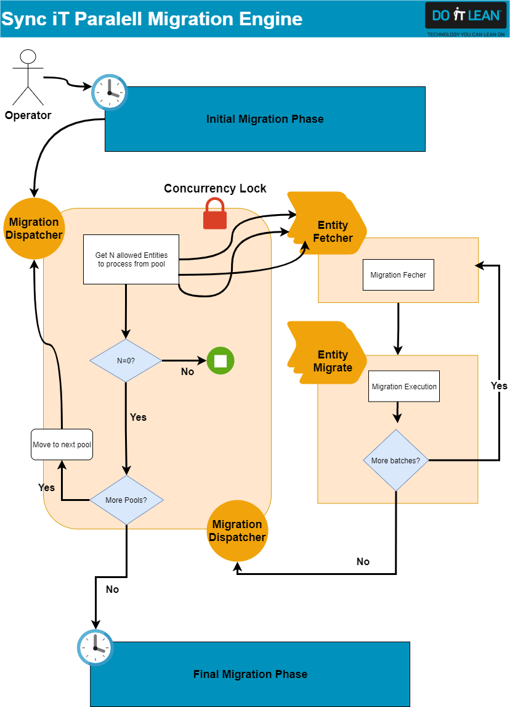

# On Speeding up SynciT

*SynciT is an application data migration tool for Outsystems environments*  

Since the first conversations I had with the SynciT Team, the ghost of parallelism was in the air.  
How fast would it be?  Could we come up with a stable model to predict the migration order?  Did Outsystems provide enough parallel mechanisms to pull it off?  
Binaries were also a pain during long migrations, taking a long time to transfer and not really moving towards the goal of having data properly migrated.
Then there was also the heart of SynciT engine - updating and matching all the migrated auto number foreign keys - often the culprit of timeouts and slow migrations.  
All these topics needed to be addressed to speed up SynciT.

-----

## Achieving Parallelism

### Directed Graphs

The first thing needed was a predictive model of the migration sequence. Database models and their relationships can be represented as directed graphs through nodes(entities) and edges(their relation). Actually, replacing RDBMS engines with Graph ones is a power move as relationships become a true first class citizen - see [neo4j](https://neo4j.com/developer/graph-database/) and [aws](https://aws.amazon.com/nosql/graph/).  
Anyways, we implemented a depth first algorithm to extract the directed graph.  

What this achieves in practical terms is that on one hand you have your work simplified to launch your Light BPTs through a known dependency order that preserves referential integrity and on the other hand you are **telling** your execution what to do instead of *asking*, speeding up things.

### Matrices  

An also noticeable aspect is that we can also represent Graphs through matrices (yeah yeah, those ones):

How cool is that? We end up with a simple 2D array to store our entire relational model. Horizontally we can check which entities an entity points to, while Vertically what entities are pointing to a particular one.  
It is also possible to quickly identify entity silos - see the yellow boxes.  

The downside here is calculating your cyclic references, needed when migrating data, to ensure referential integrity  correctness.  
**It can be achieved by calculating T^n** and then looking for entries at the identity diagonal. Here we can explicitly see one of them - SalesPerson to itself - Row 4 Column 4.  
But wait, what about the **Person-SalesPerson-Person**? It is not on the diagonal! To find every cyclic in the graph we need to calculate T^5. Whatever is not 0 on the main diagonal is circular.  
While the cost to *compute* these matrices will be higher than the depth first algorithm, there is a huge gain when **accessing** this structure at run time versus the graph - it's just a 2d array.

### Light BPTs

Outsystems had launched Light BPTs when I joined the SynciT team. While normal BPTs would technically do the job, the speed gains would be marginal, since keeping history records and having callbacks and direct launches slows down the entire thing.  
Light BPTs are the perfect mechanism but with a catch. A 3 minutes one. You see, fetching data alone for a single batch of records of a single entity can often take as much as 2minutes or more, based on server latency, columns, attribute sizes, and more, nevermind the remainder of the process of updating fks and inserting the records.
Here's how we setup the parallel migration logic (overly simplified):  

We have a dispatcher to launch a new process that migrates data for a certain entity. The migration is a composition of 2 processes - a fetcher, and an executioner.
After that, the processes themselves are responsible to re-launch the migration processes or to call the dispatcher again. A mix between an Orchestra and a Choreography, if a parallelism to micro services patterns can be made here.

-----

## In memory FK updates

SynciT's approach to match auto-numbers between 2 environments is a simple one - insert records, retrieve the ids, store them in a mapping table to map with those from source.
After that, whenever an entity needs to reference a fk, it fetches the new FK Id from said mapping table.

The opportunity to improve here, comes from the matching flow - SynciT used an approach often mentioned in Outsystems forums and blogs, of creating temporary tables to update incoming entity fk records.  
While there's nothing wrong with that, it implies a lot of disk reads and writes because temporary tables are tables after all.  
Furthermore, Oracle's Outsystems user has no permissions to create temporary tables, so that was no no anyways for Oracle.  

Moving the whole thing to memory involved some caching and taking advantage of Outsystems extensions singleton patterns, but the results factor on 10x faster and above for any given entity.

-----

## Setting binaries aside

The idea here was pretty simple. Binary files are required to transfer for a completed migration but not required for working data. So we simply moved the binary files to a parallel timer to deal with those, while the main entity migration deals with data and referential integrity.  
This achieves a ready to work environment before the binaries are all downloaded, speeding up the goal. Once the main entity migration finishes, Users can start working while the binaries are downloading even.

-----

## How fast then?  

